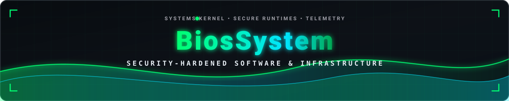
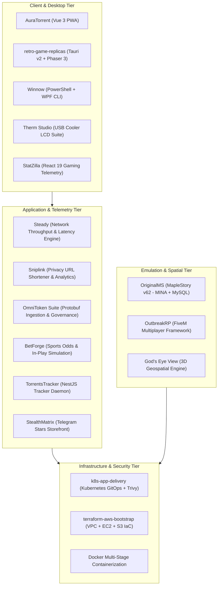

  

<h1 align="center">BiosSystem</h1>

  

  <strong>Systems Engineering | Full-Stack Applications | Security Architecture | DevOps</strong>

 

### Core Technologies & Toolchain

| Domain | Stack & Ecosystem |
|---|---|
| **Core Languages** |        |
| **Frontend & UI** |       |
| **Backend & APIs** |      |
| **Cloud & DevOps** |      |

 

## Architecture & System Topology

 

---

## Open-Source Public Projects

These repositories are open-source and publicly accessible on GitHub:

### [AuraTorrent](https://github.com/BiosSystem/AuraTorrent)

A lightweight, responsive Vue 3 Progressive Web Application (PWA) designed as a comprehensive alternative WebUI for qBittorrent.
- **Drag-and-Drop RSS**: Full feed hierarchy management with custom regex rule filtering.
- **Telegram Bot Integration**: Instant alerts pushed directly on torrent download completion.
- **Multi-Server Switcher**: Real-time management across multiple remote daemon instances with persistent local preferences.
- **Security Hardened**: Clamped route redirection guards, origin isolation, and zero query-string credential persistence.

---

### [Winnow](https://github.com/BiosSystem/Winnow)

A modular PowerShell debloat, privacy enforcement, and setup optimization toolkit for Windows 10 and 11.
- **Audit Mode Support**: Dry-run verification reports changes before system execution.
- **Granular Feature Toggles**: Selective removal of telemetry, consumer bloat, and unwanted background scheduled tasks.
- **Zero Runtime Residue**: Portable JSON profile export and import with zero external binary dependencies.

---

### [retro-game-replicas](https://github.com/BiosSystem/retro-game-replicas)

BiosSystem Neon Arcade: a cross-platform desktop arcade launcher and recreation engine.
- **11 Bundled Arcade Classics**: Full recreations optimized for responsive input and 60 FPS rendering.
- **GLSL CRT PostFX Shaders**: Authentically simulated scanlines, shadow masks, curvature, and phosphor glow with bounds clamping.
- **Native Gamepad API**: Local co-op multiplayer support via HTML5 Gamepad API.
- **Local Persistence**: Secure high-score tracking and achievement unlocks via isolated local state.

---

### [OriginalMS](https://github.com/BiosSystem/OriginalMS)

A full-fidelity MapleStory v62 (GMS 2008) server emulator running over Apache MINA network sockets.
- **Complete Content Coverage**: Scripted party quests (KPQ, LPQ, OPQ, CWKPQ), boss instances (Zakum, Horntail, Pink Bean), Cygnus Knights, and Aran classes.
- **Containerized Architecture**: Packaged in Docker Compose with auto-importing MySQL database initialization for one-command deployment.
- **High-Throughput Sockets**: Non-blocking asynchronous I/O handling channel, world, and login network traffic.

 

---

## Featured Engineering Portfolio

Comprehensive applications, telemetry engines, and specialized platforms engineered across the software stack:

### Gaming Telemetry & Desktop Systems

#### StatZilla

High-performance mobile gaming statistics tracker and live player analytics PWA.
- **Direct Official APIs**: Instantaneous player statistics, win rates, and battle logs straight from official Supercell developer endpoints.
- **Multi-Game Aggregation**: Unified tracking across Brawl Stars, Clash Royale, and PUBG Mobile.
- **Competitive Metrics**: Real-time trophy tracking, win/loss ratio graphs, and historical leaderboard indexing.

#### Therm Studio (Cpu-LCD-Therm)

A local-first creator suite and hardware telemetry engine for USB CPU-cooler LCD panels (320x320).
- **Custom Display Canvas**: Converts cooler panels into real-time sensor dashboards, layered media canvases, and system gauges.
- **Zero Vendor Bloat**: Operates independently without keeping proprietary heavy vendor suites open.
- **Hardware Telemetry**: Direct sensor readings for temperatures, fan speeds, clock frequencies, and load graphs.

#### OutbreakRP

Post-apocalyptic multiplayer zombie survival roleplay framework engineered for GTA V FiveM.
- **Dynamic Infection Mechanics**: Custom health, hunger, stamina, infection progression, and medical treatment loops.
- **Modular Factions**: Territory control, safehouse construction, dynamic loot economy, and barter markets.

---

### Network Tooling & Web Services

#### Steady (SpeedTest)

Standalone self-hosted network performance and bandwidth measurement service.
- **Zero Third-Party Dependency**: Pure internal benchmarking engine without third-party speedtest API rate limits.
- **Granular Metrics**: Measures download/upload throughput, ping, jitter, loaded latency, tail latency, and UDP packet loss.
- **Automated Scheduling**: Scheduled measurement daemons storing time-series telemetry in SQLite WAL mode.

#### Sniplink

Privacy-first URL shortening and link management service.
- **Custom Routing**: Custom alias creation, link expiration rules, and password-protected redirects.
- **Telemetry & Analytics**: Real-time click counter, referer breakdown, and geographical distribution.
- **Abuse Prevention**: Sliding-window rate limiting, origin verification, and bot detection filters.

#### TorrentsTracker

Private invite-based BitTorrent tracker platform with an end-to-end TypeScript architecture.
- **High-Performance Tracker**: Dedicated NestJS announce and scrape daemon handling concurrent peer swarms.
- **Modern Catalog UI**: Next.js App Router member portal with category browsing, peer tables, and ratio enforcement.

---

### AI Governance & Specialized Platforms

#### OmniToken Suite

Multi-agent AI token metering, protobuf telemetry decoding, and cost governance suite.
- **Offline Ingestion Engine (`omni-token-telemetry`)**: Decodes protobuf and wire logs, executing monotonic high-water ratchets.
- **Analytics Dashboard (`tokens-dashboard`)**: Next.js 15 App Router executive dashboard for real-time model token consumption and ROI reporting.

#### BetForge

Sports analytics platform and dynamic odds computation sandbox.
- **In-Play Market Pricing**: Real-time odds conversion across decimal, American, and fractional representations.
- **Interactive Bet Slip**: Dynamic bet accumulation, payout multipliers, cash-out workflows, and live model simulation.

#### God's Eye View

Interactive 3D geospatial intelligence platform rendering real-time spatial telemetry on a photorealistic digital globe.
- **Live Entity Tracking**: Simultaneous visualization of orbital satellites, commercial aviation, maritime vessels, and seismic events.
- **Tactical HUD**: WebGL-powered telemetry HUD with coordinates, altitude, velocity, and trajectory vectors.

#### StealthMatrix

Self-hosted Telegram e-commerce storefront bot.
- **Telegram Stars Payments**: In-app digital payments integration with invoice validation and order fulfillment.
- **Security Middlewares**: Sliding-window rate limiting, input sanitization against HTML injection, and parameterized queries.

---

### Cloud Infrastructure & Security Sandboxes

- **terraform-aws-bootstrap**: Modular, secure-by-default AWS infrastructure deploying an isolated VPC across two AZs, a private-subnet EC2 instance accessible strictly via SSM Session Manager, and an encrypted S3 bucket with Checkov and TFLint validation.
- **k8s-app-delivery**: Production-grade Kubernetes GitOps application delivery sandbox with multi-stage Docker builds, liveness/readiness probes, and Trivy static security scanning in CI.

 

---

## Active Projects Overview

| Project | Domain | Stack | Delivery & Highlights |
|---|---|---|---|
| [AuraTorrent](https://github.com/BiosSystem/AuraTorrent) | Web Application | Vue 3, Vite, Pinia, TypeScript | Public OSS - PWA replacement WebUI for qBittorrent with Telegram finish alerts |
| [Winnow](https://github.com/BiosSystem/Winnow) | System Utility | PowerShell, WPF | Public OSS - Windows debloat and setup toolkit with audit mode and JSON profiles |
| [retro-game-replicas](https://github.com/BiosSystem/retro-game-replicas) | Desktop Gaming | Tauri v2, Phaser 3, TypeScript, Rust | Public OSS - Desktop arcade launcher with 11 games, CRT shaders, and gamepad API |
| [OriginalMS](https://github.com/BiosSystem/OriginalMS) | Game Server | Java 8, Apache MINA, MySQL, Docker | Public OSS - MapleStory v62 server emulator with all PQs, bosses, and jobs working |
| StatZilla | Gaming Telemetry | React 19, TypeScript, Supercell APIs | Mobile game player stats and live battle analytics for top mobile titles |
| Steady | Network Tooling | React 19, FastAPI, SQLite, Docker | Self-hosted network performance, latency, and throughput testing suite |
| Sniplink | Web Service | React 19, FastAPI, SQLAlchemy | Secure URL shortener with custom slugs, link expiration, and telemetry |
| OmniToken Suite | AI Governance | Next.js 15, Python 3.12, TypeScript | AI token telemetry, protobuf decoding, and cost governance dashboard |
| Therm Studio | Desktop Hardware | TypeScript, Electron, Hardware APIs | Local-first USB CPU-cooler LCD dashboard and creator suite |
| BetForge | Sports Analytics | React 18, TypeScript, Vite | Sports betting odds display, bet slip manager, and cash-out flow |
| God's Eye View | Geospatial 3D | TypeScript, Cesium, Three.js, WebGL | Photorealistic 3D globe with live satellite, air, and maritime tracking |
| StealthMatrix | E-Commerce | Python 3.11, Aiogram 3.7, SQLite | Telegram store bot with Telegram Stars payments and order management |
| TorrentsTracker | BitTorrent Infra | NestJS, Next.js, PostgreSQL, Prisma | Private BitTorrent tracker platform with announce/scrape daemon |
| OutbreakRP | Multiplayer Modding | Lua, TypeScript, FiveM FXServer | GTA V zombie apocalypse roleplay server framework with loot economy |
| Cloud DevOps Sandboxes | Cloud & GitOps | Terraform, Kubernetes, AWS, Docker | Secure AWS VPC/EC2/S3 IaC and Kubernetes GitOps delivery pipelines |

 

> Detailed architecture specifications, hardening models, and security protocols: [**WIKI.md**](docs/WIKI.md)

 

---

## GitHub Activity & Statistics

  
  

  

 

  

